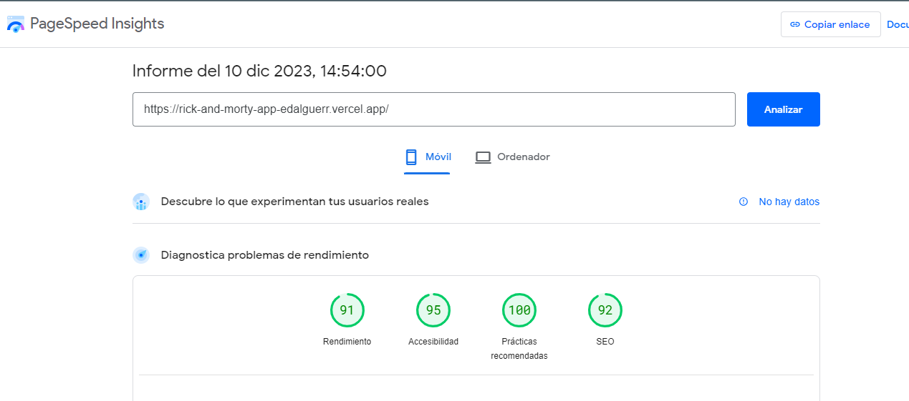

# Rick and Morty

Angular app based on the Rick and Morty [API](https://rickandmortyapi.com/). It incorporates functionalities to list, filter, paginate, and view details of characters, episodes, and locations.

## Links

- Live site url: [See live](https://rick-and-morty-app-edalguerr.vercel.app/)
- Solution url: [See solution](https://github.com/edalguerr/rick-and-morty-app)
  

## Built with

- Angular 17
  - Standalone components
  - SSR
  - NgOptimizedImage
- Skeletons (ngx-skeleton-loader)
- Infinite scroll (ngx-infinite-scroll)
- I18n (@ngx-translate/core)
- NgRX (to store favorite characters) - **ongoing**
- BEM Methodology